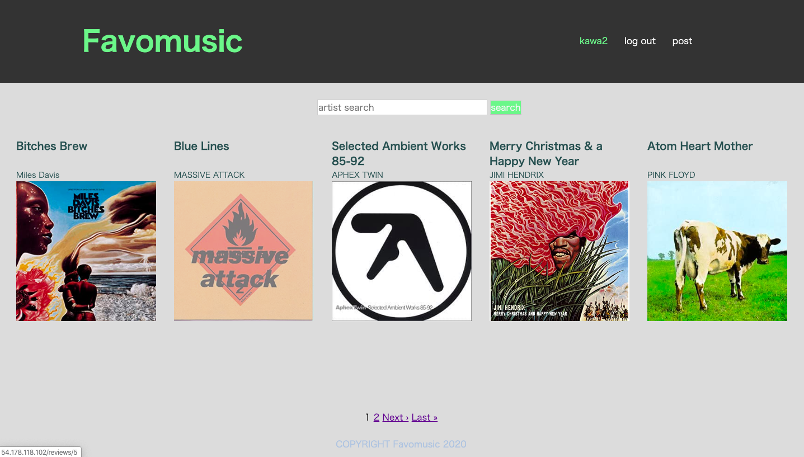

# Favomusic

## おすすめ音楽レビュー投稿アプリ

[Favomusicはこちらから](http://54.178.118.102/)

## 機能
### 未ログイン時
- レビューの閲覧
- 投稿者ページ閲覧
- 投稿をアーティスト名で検索
- ページネーション機能

### ログイン時
- レビュー投稿(タイトル、アーティスト名、説明、画像)
- レビューに対するコメント機能
- 投稿をアーティスト名で検索
- マイページ機能
- 投稿済レビューの編集機能
- 投稿済レビューの削除機能
- ページネーション機能

## 使用技術
- Ruby on rails,ruby,haml,sass,JQuery,MySQL,Github
- AWSのEC2上にnginxとunicornを用いてデプロイ
- Capistranoを利用した自動デプロイ

## 制作背景
友人にミュージシャン、DJ、など音楽好きが多く、まずは身近な友人達に実際に使って貰いたいと思いおすすめ音楽レビューアプリを作りました。
見た目、機能はかなりシンプルな作りにしています。
SNSでも同じ事は出来ますが、様々な情報が次から次に押し寄せてくるのでこのアプリ上では音楽だけに焦点を当てた濃い内容が使用者様の手に届けばと思っています。

## 課題
- 画面のスクロールがなく寂しいのでJava Scriptで見た目にもっと動きをつける必要がある。(コメント投稿フォームではJQuery使用)
- メールアドレスによるユーザー登録のみなのでSNSなどのアカウントを使って新規登録できるよう選択肢を増やす
- レビューだけではなく音楽ファイル再生機能の実装

## DB

### usersテーブル
|Column|Type|Options|
|------|----|-------|
|nickname|string|null: false|
|email|string|null: false|
|password|string|null: false|
#### Association
- has_many :reviews
- has_many :comments

### reviewsテーブル
|Column|Type|Options|
|------|----|-------|
|title|string|null: false|
|artist|string|null: false|
|text|text|  |
|image|text|  |
|user_id|integer|null: false|
#### Association
- has_many :comments
- belongs_to :user

### commentsテーブル
|Column|Type|Options|
|------|----|-------|
|user_id|integer|  |
|review_id|integer|  |
|text|text|null: false|
#### Association
- belongs_to :user
- belongs_to :review
